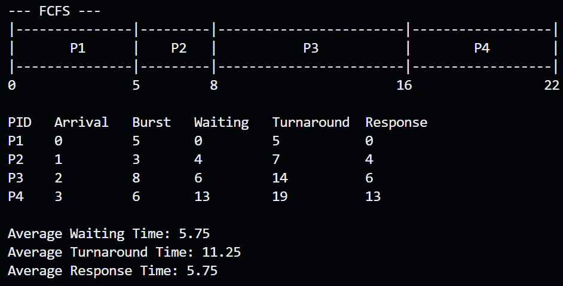
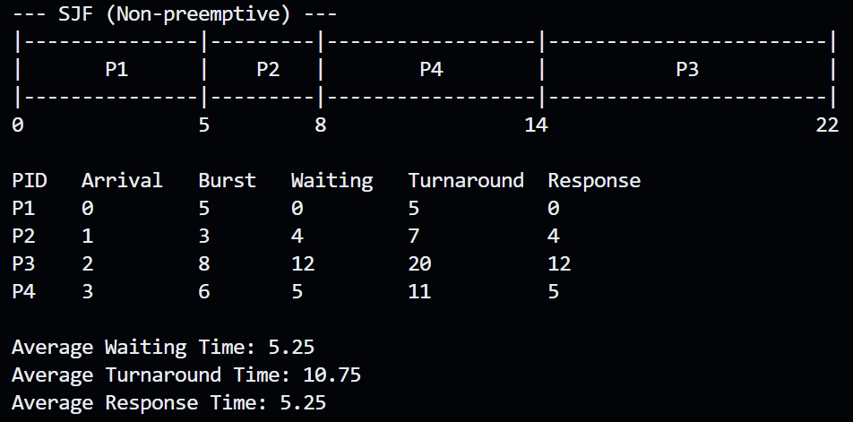
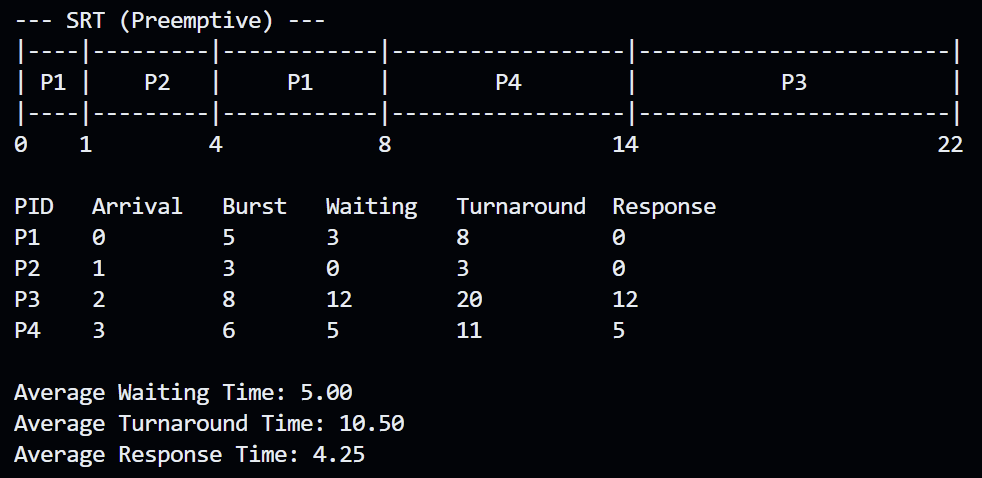
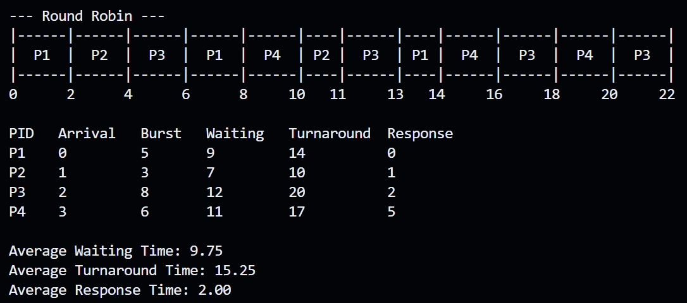
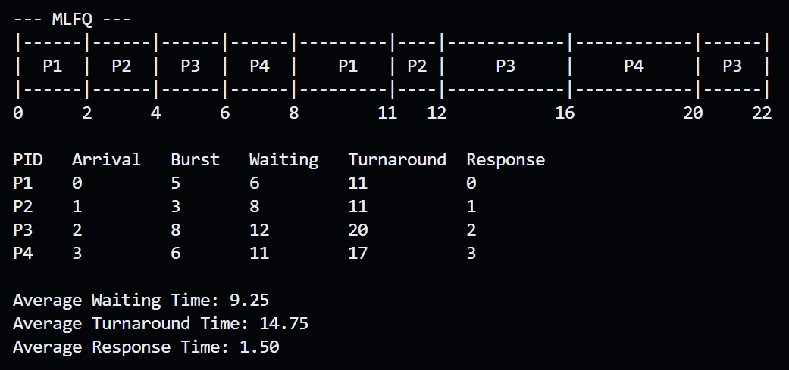

# CPU Scheduling Algorithm Simulator

A command-line simulator that models five classic CPU scheduling algorithms — FCFS, SJF, SRT, Round Robin, and MLFQ — and reports Gantt charts plus waiting/turnaround/response time metrics for each.

## Setup and Installation

**Requirements:** Python 3 (no external libraries needed — only the standard library is used).

1. Clone or download the project files and keep this folder structure:
   ```
   project/
   ├── main.py
   ├── process.py
   ├── input_parser.py
   ├── metrics.py
   ├── gantt.py
   └── algorithms/
       ├── fcfs.py
       ├── sjf.py
       ├── srt.py
       ├── rr.py
       └── mlfq.py
   ```
2. No `pip install` is required — everything runs on Python's built-in `csv` and `json` modules.
3. From the project's root folder, run:
   ```
   python3 main.py
   ```

## Algorithms Implemented

- **FCFS (First Come, First Served)** — Non-preemptive. Processes run strictly in order of arrival time. Simple, but suffers from the "convoy effect" when a long process blocks shorter ones behind it.
- **SJF (Shortest Job First, Non-preemptive)** — At each decision point, picks the arrived process with the smallest total burst time. Once started, a process runs to completion.
- **SRT (Shortest Remaining Time, Preemptive)** — The preemptive version of SJF. At every time tick, if a newly arrived process has less remaining time than the one currently running, the CPU switches to it.
- **Round Robin (RR)** — Each process gets a fixed time slice ("quantum"). If it doesn't finish within that slice, it's moved to the back of the ready queue. Great for fairness and response time.
- **MLFQ (Multilevel Feedback Queue)** — Uses three queues with increasing time slices (Queue 0: quantum 2, Queue 1: quantum 4, Queue 2: FCFS/unlimited). New processes start in Queue 0; if they use their full quantum, they're demoted a level. An aging mechanism promotes processes that have waited too long in lower queues, preventing starvation.

## How to Run Each Scheduler

1. Start the program:
   ```
   python3 main.py
   ```
2. Choose how to provide process data:
   - `1` — Use the built-in sample scenario (P1–P4)
   - `2` — Load from a CSV file (must have columns: `pid,arrival,burst,priority`; priority is optional)
   - `3` — Load from a JSON file (list of objects with `pid`, `arrival`, `burst`, and optional `priority`)
   - `4` — Enter processes manually via the console
3. From the main menu, choose:
   - `1` — Run a single algorithm (you'll then pick FCFS/SJF/SRT/RR/MLFQ from a submenu)
   - `2` — Compare all five algorithms at once (uses default quantum/aging settings) and print a summary table of averages
   - `3` — Load a new set of processes
   - `4` — Exit
4. For **Round Robin**, you'll be prompted for a time quantum (default: 2).
5. For **MLFQ**, you'll be prompted for Queue 1 quantum (default: 2), Queue 2 quantum (default: 4), and an aging threshold (default: 10).

### Sample CSV format
```csv
pid,arrival,burst,priority
P1,0,5,0
P2,1,3,0
P3,2,8,0
P4,3,6,0
```

### Sample JSON format
```json
[
  {"pid": "P1", "arrival": 0, "burst": 5},
  {"pid": "P2", "arrival": 1, "burst": 3},
  {"pid": "P3", "arrival": 2, "burst": 8},
  {"pid": "P4", "arrival": 3, "burst": 6}
]
```

## Sample Input / Output

**Input (sample scenario):**

| PID | Arrival | Burst |
|-----|---------|-------|
| P1  | 0       | 5     |
| P2  | 1       | 3     |
| P3  | 2       | 8     |
| P4  | 3       | 6     |

**Output — SJF (Non-preemptive):**

```
--- SJF (Non-preemptive) ---
|----------------|--------|--------------------|--------------------|
|       P1       |   P2   |         P4         |         P3         |
|----------------|--------|--------------------|--------------------|
0                5        8                    14                   22

PID    Arrival   Burst   Waiting   Turnaround  Response
P1     0         5       0         5           0
P2     1         3       4         7           4
P3     2         8       12        20          12
P4     3         6       5         11          5

Average Waiting Time: 5.25
Average Turnaround Time: 10.75
Average Response Time: 5.25
```

**Output — "Compare all algorithms" summary table:**

```
Algorithm           Avg Waiting    Avg Turnaround    Avg Response
FCFS                5.75           11.25             5.75
SJF (Non-preemptive) 5.25          10.75             5.25
SRT (Preemptive)    5.00           10.50             4.25
Round Robin         9.75           15.25             2.00
MLFQ                9.25           14.75             1.50
```

## Screenshots / Gantt Chart Output

**A screenshot of the FCFS output**



**A screenshot of the SJF output**



**A screenshot of the SRT output**



**A screenshot of the RR output**



**A screenshot of the MLFQ output**



To capture these, run `python3 main.py`, select the sample scenario, run each algorithm individually, and screenshot the Gantt chart + metrics table printed to the terminal (like the SJF example above).